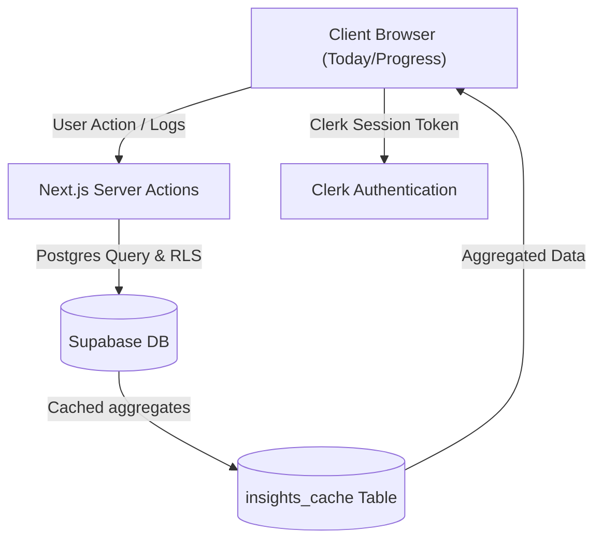

> **Vault sync:** Copied from `Documents/Port Sites/Category 5/Momentum/` on 2026-07-09. Edit the project folder first; re-sync the vault after doc changes.

# Momentum
*06/07/2026 12:53: This README file is STALE and does not reflect the current state of the project. Update required in Phase 1*

Your personal daily operating system for habits and fitness that helps you get jacked and clearly shows where you’re winning or failing.

[](https://nextjs.org/)
[](https://www.typescriptlang.org/)
[](https://supabase.com/)
[](https://clerk.com/)
[](https://tailwindcss.com/)

---

> **Status:** Phase 0 Foundation (docs realigned). Personal daily driver in active development. Target ship + 14-day dogfood: August 2026.

## Table of Contents
- [Overview](#overview)
- [The Daily Walkthrough](#the-daily-walkthrough)
- [Tech Stack](#tech-stack)
- [Architecture & Data Flow](#architecture--data-flow)
- [Project Directory Structure](#project-directory-structure)
- [Local Setup & Installation](#local-setup--installation)
- [Internal Project Documentation](#internal-project-documentation)
- [License](#license)

---

## Overview

Momentum is a beautiful, low-friction **personal** habit and fitness tracker. It is designed specifically to eliminate the logging friction of commercial SaaS apps and replace it with direct, statistical insights. Rather than relying on generic, bloated tracking systems, Momentum correlates habits, fitness volume, and wellness snapshots (mood, sleep, energy) to show you exactly how your lifestyle choices drive your progress.

**Key Value Propositions:**
*   **Frictionless Daily Logging:** Log a complete day of habits, sleep, mood, and workouts in under 30 seconds.
*   **aha! Statistical Insights:** Direct percentage lifts and correlations (e.g. *"You complete 23% more habits on days with ≥7h sleep"*) computed using SQL aggregates.
*   **Portfolio-Ready Taste:** Built with a premium, performance-first glassmorphism design system in dark mode, containing polished animations.
*   **Why Momentum?** Commercial trackers failed me with friction and generic insights. This one is built for *me* — and it shows in the results.
---

## The Daily Walkthrough

Momentum is built around a simple, high-impact daily logging flow:

```
  [Land on Today Hub] ──> [Log Wellness & Habits] ──> [View Wins & Failures]
  (Unified Bento View)      (Completed in <30s)        (Statistical Insights)
```

1.  **Step 1: Land on the Today Dashboard (`/today`)**
    When you open the app, you are greeted by a unified Bento-style dashboard containing your due habits, a wellness card, and a workout log summary.
2.  **Step 3: Frictionless Logging**
    With single-tap widgets, you log your daily wellness snapshot (Mood 1-5, Energy 1-5, Sleep hours) and check off your habits with optional logs/notes.
3.  **Step 4: Win/Loss Analysis**
    Your metrics are instantly compiled into the Insights Engine. Transitioning to `/progress` highlights streaks, volume trends, and correlations to show exactly where you are winning or losing momentum.

---

## Tech Stack

Momentum uses a modern, high-performance web stack:

*   **Framework:** [Next.js 16](https://nextjs.org) (App Router, React Server Components)
*   **Database:** [Supabase](https://supabase.com) (PostgreSQL with Row Level Security (RLS) policies)
*   **Authentication:** [Clerk Auth](https://clerk.com) (custom-styled to match the app's glassmorphism)
*   **Styling:** [Tailwind CSS v4](https://tailwindcss.com) + [shadcn/ui](https://ui.shadcn.com)
*   **State Management:** [Zustand](https://github.com/pmndrs/zustand)
*   **Client Fetching & Cache:** [TanStack React Query v5](https://tanstack.com/query)
*   **Visualization:** [Recharts](https://recharts.org)
*   **Animations:** [Framer Motion](https://www.framer.com/motion/) (under a strict performance-first constitution)

---

## Architecture & Data Flow

Momentum leverages React Server Components (RSC) to render data-heavy modules on the server, maintaining minimal client bundle sizes and ensuring fast loads.



*   All data operations utilize Row Level Security (RLS) scoped to the authenticated Clerk user (`auth.jwt() ->> 'sub'`).
*   The insights engine calculates metrics and aggregates, caching them in the `insights_cache` table to keep dashboard loads instant on mobile devices.

---

## Project Directory Structure

```
├── app/                      # Next.js App Router
│   ├── actions/              # Server Actions for DB operations
│   ├── api/                  # API routes (e.g. Clerk webhooks)
│   ├── components/           # Core Layout and App-wide components
│   ├── fitness/              # Workout logs, templates & session tracking
│   ├── habits/               # Habit CRUD & detail charts
│   ├── progress/             # Statistical insights & Recharts visualizations
│   ├── settings/             # Preferences & data export
│   └── today/                # Core bento dashboard
├── components/               # Global UI components (shadcn/ui)
├── lib/                      # Helper libraries, Supabase clients & utils
├── public/                   # Static assets (logo.svg, etc.)
├── supabase/                 # DB migrations, schema declarations & seeds
└── AGENTS.md                 # Safety guidelines for AI coding assistants
```

---

## Local Setup & Installation

Follow these standard steps to set up Momentum locally:

### Prerequisites
*   Node.js (v20+ recommended)
*   npm or pnpm
*   A Supabase project (PostgreSQL database)
*   A Clerk application for authentication

### Installation Steps

1.  **Clone the repository:**
    ```bash
    git clone https://github.com/your-username/momentum.git
    cd momentum
    ```

2.  **Install dependencies:**
    ```bash
    npm install
    ```

3.  **Configure environment variables:**
    Copy `.env.example` to `.env` and fill in your Supabase and Clerk API credentials:
    ```bash
    cp .env.example .env
    ```

4.  **Run the development server:**
    ```bash
    npm run dev
    ```

5.  **Access the application:**
    Open [http://localhost:3000](http://localhost:3000) in your web browser.

---

## Internal Project Documentation

For contributors and AI coding assistants, refer to the following local documentation:

*   **[AGENTS.md](./AGENTS.md)** — Critical safety rules for AI coding agents.
*   **[PRD.md](./PRD.md)** — Core vision and non-goals (Living Bible).
*   **[TRD.md](./TRD.md)** — Tech & performance constitution.
*   **[UIUX_BRIEF.md](./UIUX_BRIEF.md)** — Glassmorphism + design system.
*   **[PAGE_SPECS.md](./PAGE_SPECS.md)** — Page layouts and flows.
*   **[SCHEMA.md](./SCHEMA.md)** — Database schema + demo seed.
*   **[PHASES.md](./PHASES.md)** — Current execution roadmap.
*   **[INSIGHTS.md](./INSIGHTS.md)** — "Why" layer specifications.
---

## License

This project is licensed under the MIT License. See the LICENSE file for details.
