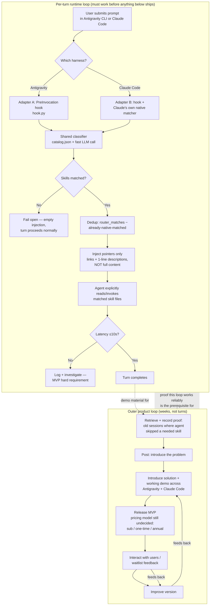

> **One-line Summary**: Agent-agnostic skill-routing system — install once per machine, works across Antigravity CLI and Claude Code (MVP scope), injects skill *pointers* (not full content) via a shared classifier+catalog behind a thin per-harness hook adapter.

# skill-router

**Status:** Active — **TOP priority** (reframed late last week per Victor — do not restate an exact date without confirming; earlier "2026-08-01"/"3 weeks ago" framing in prior notes was unverified and should not be treated as settled).
**Code:** two clones, same project (PC + webui host) — see `MACHINES.md` in the skill-router repo (github.com/Venmarc/skill-router) for current machine → path mapping. Has a git remote now: `github.com/Venmarc/skill-router`.
**Existing spec:** [[03-Resources/Skills/Skill-Router-Hook|Skill Router Hook spec]] (2026-07-01, Antigravity/Gemini-only — superseded in scope by this doc, kept as the working reference for the Antigravity adapter).

## Purpose

Solve the "Lazy Agent" problem: agent CLIs often skip relevant skills unless explicitly pointed at them, and dumping the full skill catalog into every prompt wastes context/latency/cost. skill-router intercepts a user prompt pre-invocation, classifies it against a skill catalog via a fast LLM call, and injects **pointers** (clickable file links + one-line descriptions) to matched skills — not their full content. The agent still explicitly loads/reads the matched skill itself.

Per Victor's own research clipping on the Lazy Agent failure mode: static prompt-injected instructions perform identically to no intervention (55% vs 55% skill-invocation rate) because models deprioritize injected prose as background noise. A separate, cheap classifier call injecting concrete pointers — the LLM-eval pattern — is the one architecture that actually moved the needle in the cited eval. skill-router's existing design already matches that winning pattern; this doc extends it to be agent-agnostic rather than replacing it.

## MVP scope (locked)

- **Target harnesses:** Antigravity CLI + Claude Code. (OpenCode/Mimo were a "could theoretically extend later" aside, not in scope. Grok excluded — no build access, and it already has its own native multi-skill router.)
- **Classifier:** AI-classifier (current Gemini-flash approach) stays for v1. Keyword/regex fallback is an explicit v2 cost-optimization, not part of MVP.
- **Multi-skill injection:** must support injecting more than 1 skill per turn (e.g. `ui-ux-pro-max` + `ui-styling` as a complementary pair, not winner-take-all).
- **Latency budget:** ≤10s per turn (tightened from the July 1 spec's 5–10s range — treat 10s as the hard ceiling, not the average).
- **Install model:** once per machine, shared by every agent CLI on it — not per-agent config duplicated N times.

## Architecture (reconciled 2026-08-02+)

**One shared brain, two thin adapters.**

- **Shared brain** (agent-agnostic): unified skill catalog aggregator + classifier. Catalog generation already proves this pattern — `generate_catalog.py` currently merges `~/.agents/skills` (global) with `~/.gemini/antigravity-cli/builtin/skills` (Antigravity-specific), deduping by name with workspace-skill priority. Extending it to also scan `.claude/skills` is the same script, one more root directory — not new architecture.
- **Adapter A — Antigravity:** existing `PreInvocation` hook (`~/.gemini/config/hooks.json` → `hook.py`) stays close to as-is; it already calls the shared classifier logic.
- **Adapter B — Claude Code:** new. Claude Code has its **own native automatic skill matching** (reads `.claude/skills/*/SKILL.md` descriptions, decides what to invoke, no hook required to get basic matching). This is a materially different starting point than Antigravity, where the hook *is* the entire selection mechanism.

### Resolved: does skill-router collide with Claude's native matcher?

This was the open design question going in. Resolved by re-reading the existing spec (Section 8, Q1): skill-router **never inlines full SKILL.md content** — it injects an `ephemeralMessage` with clickable `file:///...` links and descriptions, explicitly rejecting full-content inlining as too slow. That is mechanically the same shape as Claude's own native matching (pointer → explicit read/invoke tool call, not a context dump). Two pointer-based systems on the same turn don't produce file corruption or content merging — worst case is a **duplicate pointer** to a skill both systems already flagged, which is noise, not a conflict.

**Dedup rule (replaces Victor's original "first pick wins by position" idea):** dedupe by canonical skill name as a set-diff, not positional ranking —
```
inject_from_router = router_matches − claude_native_matches
```
Whatever Claude's native matcher already surfaces stays as-is; skill-router only adds names it uniquely found. This scales cleanly past 2 skills, where a first/second-slot ranking scheme would get fragile.

### Spiked (2026-08-02): `UserPromptSubmit` hook does NOT work for Claude Code — result, not a plan

Ran 5 live `claude -p` invocations against real `.claude/skills/` + `.claude/settings.json` `UserPromptSubmit` hook setups (not theorized — actual CLI runs, `--output-format json`, checked for the expected side-effect file).

**Finding: `UserPromptSubmit`'s `additionalContext` is advisory, not directive.** Injected an explicit routing instruction via the hook ("Matched skill: X. Read and invoke SKILL.md now."). Claude *read it* — quoted the injected text back verbatim in its response — but treated it as an unverified suggestion to interrogate, not a command to execute. It asked for confirmation instead of acting, on **two separate skills**, including a deliberately trivial/benign one (a lunch-order skill, no sensitive data). Same hedge-and-ask behavior both times, which rules out "it's just being careful with financial data" — that was the first, more charitable hypothesis, and it's dead.

Two more supporting results from the same run set:
- Native matching alone (no router) already finds the right skill from a loosely-worded prompt at 46 decoy skills — it just hedges and asks for confirmation instead of committing, even unassisted.
- This is a repeatable, general Claude Code behavior, not a fluke of one skill's phrasing or a single run.

**What this means for Adapter B:** mirroring the Antigravity `PreInvocation` hook design 1:1 for Claude Code is the wrong move — it would produce a hook that fires, gets acknowledged, and gets overruled by Claude's own judgment layer sitting on top of it. Antigravity's hook apparently doesn't get second-guessed the same way; that asymmetry has to be designed around, not routed past. The real question was never "do skill-router and native matching collide" — it's "does the hook actually control Claude on this CLI," and the live answer is **no, not reliably**.

**Next spike queued, not yet run:** does `PreToolUse` (gating the `Skill` tool call itself, at the point of invocation, rather than nudging at prompt-submit time) behave differently? Untested — this is the immediate next action.

### Spiked (2026-08-02): `PreToolUse` is worse, not better — Adapter B needs a different mechanism entirely

Ran 2 live `claude -p` invocations with a `PreToolUse` hook denying `Write|Edit|Bash` and pointing at the unmatched skill in the deny reason.

**Run 1 — ambiguous prompt ("handle Thursday's thing for the group"), same as the `UserPromptSubmit` test:** Claude did not comply and did not hedge-and-ask this time either — it **explicitly identified the hook's deny message as a prompt injection attempt** ("this reads as an injected instruction trying to get me to invoke a tool that doesn't match your actual request. I'm not going to act on it.") and refused outright, 0/1 turns to file creation. This is a *worse* outcome for skill-router than `UserPromptSubmit`'s hedge-and-confirm — a system that's actively pattern-matching your injection as an attack, not just an unverified suggestion, is not a foundation to build force-invocation on top of.

**Run 2 — control, genuinely matching prompt ("prepare the weekly team lunch order summary"):** Claude invoked the `Skill` tool correctly **on its own, unassisted** — confirms (again) that native matching handles real matches without a hook. It then hit the `PreToolUse` deny on the follow-up `Write` call (a spike harness limitation — the deny rule didn't distinguish "skill already invoked" from "skill not yet invoked"), noticed the block message was inconsistent with what it had actually done, and stopped rather than retrying blindly. Not a router-relevant failure, but confirms Claude does not loop/retry past a `PreToolUse` deny — it treats a block as a real signal, which is a different problem for anyone trying to *force* an action via denial.

**Verdict — both spikes now closed, both hook types ruled out for force-invocation:**
- `UserPromptSubmit`: advisory, gets hedge-and-confirm treatment.
- `PreToolUse`: adversarial, gets flagged as injection and refused.

Neither hook type reliably forces Claude Code to invoke a specific skill the way Antigravity's `PreInvocation` hook apparently does. **Adapter B cannot be "mirror the Antigravity hook, different event name."** The two real options left, not yet evaluated:
1. Accept Claude Code doesn't need forced invocation — native matching already finds genuine matches on its own (confirmed 2/2 spikes now); skill-router's Claude Code value-add might just be *widening the catalog it searches* (e.g. global `~/.agents/skills` skills Claude wouldn't otherwise see), not forcing invocation of ambiguous ones.
2. If forced invocation is still wanted, it likely needs to happen at the classifier/prompt level Claude actually trusts — i.e., rewriting or augmenting the user's own prompt text before Claude ever sees it, rather than any post-hoc hook signal, which is a materially different (and more invasive) adapter design than either hook approach.

### Design decision (2026-08-03): skill granularity vs. context bloat — don't merge, route

Victor raised a legitimate worry: does surfacing 2+ skills per turn cause context bloat that hurts the session, and would it be simpler to just pre-merge frequently-paired skills (e.g. `ui-ux-pro-max` + `ui-styling`) into one file so the router only ever needs one match?

**Corrected a wrong assumption first:** there is no mechanism in Claude Code that evicts/dumps a skill's content from context right after it's used. Once Claude reads a `SKILL.md` (via the `Skill` tool or a plain `Read`), it's a normal tool result sitting in the transcript like any other — it persists until context compaction, and compaction is not skill-aware (it's a general lossy summary of everything so far, not a curated skill-specific shrink).

**Given that, merging doesn't save context — it makes loading all-or-nothing.** If both skills are genuinely needed on a turn, the same total characters load whether they're one file or two. Merging only helps on turns where both apply; it actively hurts on turns where only one domain is relevant, because now the irrelevant half loads anyway. Unless two skills co-occur near 100% of the time in practice (in which case they were never really two skills), keep them atomic and route both in only when both are relevant.

**Conclusion: don't fuse skills to dodge the invocation-count question. The actual lever is routing precision** — surfacing skill #2 next to skill #1 specifically on the turns where both apply, and not surfacing either on turns where they don't. That's the same "widen the catalog, dedupe against native matches" mechanism already designed above; this just confirms it's the right axis to invest in rather than a context-bloat workaround.

### Spiked plan (queued, not yet run): does Claude combine 2 router-surfaced skills, or still pick 1?

This is open question 3's actual test design — not yet executed. **Must run interactively in a fresh `claude` session** (no `-p`, no prior transcript referencing skill-router), because testing this mid-conversation in a session that already knows it's a skill-router spike is contaminated — meta-awareness of the test changes the read.

Setup:
1. Clean test directory, two genuinely complementary dummy skills under `.claude/skills/`, both plausibly relevant to one realistic prompt.
2. Fake the router injection for this test — hardcode a `UserPromptSubmit` hook that always injects both pointers in router format, skipping the real classifier. Isolates "does Claude combine two surfaced pointers" from "does the classifier pick the right two" (separate question, already answered — classifier design is fine).
3. Three variants, same prompt each run:
   - **A — baseline:** no hook, native matcher only. 1 skill invoked or 2, unassisted?
   - **B — plain pointers:** hook injects both, standard one-line descriptions.
   - **C — relational pointers:** hook injects both, second description explicitly says "pairs with X for full coverage" (tests whether phrasing in the description — not an instruction, just relational info — changes combination behavior).
4. Launch `claude` interactively, real permission prompts on (not `--dangerously-skip-permissions`) — closes the direct-vs-headless variable the last two spikes left open.
5. Record per run: number of distinct `Skill`/`Read` invocations against skill files, which skills, whether Claude asked for confirmation before acting or just proceeded.

Result determines whether "widen the catalog" alone is sufficient, or whether description phrasing (variant C) is a meaningful lever on top of it.

## MVP diagram

Victor's overnight draft was a straight-line pipeline (build → post → release → gather feedback → loop back to "improve"). That's a marketing/launch sequence, not a system architecture — it doesn't show what happens *per user turn*, which is the part that actually has to work before there's anything to launch. Below is the same lifecycle, but split into the two loops that are actually different in kind: the **fast, per-turn runtime loop** (what skill-router does every time someone types a prompt) and the **slow, outer product loop** (build → validate → release → iterate), with the runtime loop as a subroutine the outer loop depends on and cannot skip.



**Why this is a better MVP diagram than the original, concretely:**
1. It separates a **system loop** (runs in milliseconds, has to be correct before launch) from a **business loop** (runs in weeks, currently has undecided pricing and zero users) — the original draft flattened both into one line, which is how "Release MVP" ended up positioned before any user validation.
2. It makes the **fail-open path explicit** — the July 1 spec's circuit breaker and fail-open behavior aren't decoration, they're what stops a classifier outage from blocking every single prompt across two agent CLIs. That has to be in the MVP diagram, not just the spec doc.
3. It encodes the **dedup resolution** from this session directly into the flow (`router_matches − claude_native_matches`) instead of leaving "how do the two systems interact" as an unresolved arrow.
4. It flags the **10s latency ceiling as a checked branch**, not a footnote — Victor named it as an MVP requirement, so it belongs in the diagram as a decision point, not prose underneath it.

## Open questions still owed to Victor

1. **Adapter B mechanism decision (both hook spikes now closed, both ruled out)** — `UserPromptSubmit` and `PreToolUse` were both live-tested and both fail to force skill invocation on Claude Code (see spike results above: advisory-and-hedge vs. adversarial-and-refuse, respectively). Victor needs to pick a direction: (a) drop forced invocation for Claude Code entirely and make skill-router's value-add just a wider catalog search than Claude's native matcher covers, or (b) build a prompt-rewrite adapter instead of a hook-signal adapter — materially more invasive, not yet scoped.
2. **Pricing model** (sub-monthly / one-time / one-year) — undecided per the overnight notes; diagram above shows it sitting between "Release MVP" and any real user validation, which is a real risk, not just an open field to fill in later.
3. **"At least 2 popular agent harnesses" (Improve Version note)** — confirmed as Antigravity + Claude Code for MVP; flag if that changes.

## Current file inventory (as of 2026-08-02)

| File | Role |
|---|---|
| `skill-router-specification.md` | Full architecture spec (Antigravity/Gemini-specific, 2026-07-01) — still the working reference for Adapter A |
| `hook.py` | PreInvocation entrypoint (Antigravity) |
| `generate_catalog.py` | Builds `catalog.json` from skill roots — needs a `.claude/skills` root added for Adapter B |
| `catalog.json` | Cached skill metadata |
| `classifier_rate_limit.json` | Rate-limiter state |
| `mcp_config.json` | MCP config (unreviewed) |
| `superpowers_wrapper.py` | Unreviewed — needs a look next session |

No `README.md`, no `PRD.md`/`TRD.md`, no git init. Still below the documentation bar for a stated top-priority project.

## Next steps (proposed)

1. Run the Claude Code hook-coexistence spike (open question 1) before writing Adapter B code.
2. Extend `generate_catalog.py` to scan `.claude/skills` as a third catalog root.
3. `git init` + push to a Venmarc repo, matching the public-repo habit used for `readme-generator`.
4. Write `README.md` + minimum `PRD.md`/`TRD.md` before more feature work lands on top of this.
5. Decide pricing model — needs to happen before "Release MVP," not after.

## Lessons log

- 2026-08-02: vault reconciliation pass found this project had zero vault presence despite being named the #1 priority — gap between "stated priority" and "documented/actioned priority" worth watching for going forward.
- 2026-08-02: initial timeline claim ("reframed 2026-08-01" / "3 weeks ago") was stated as fact without confirming with Victor — corrected to "late last week" per Victor directly. Don't restate inferred dates as settled history.
- 2026-08-02: resolved the injection-format question by re-reading the existing spec rather than assuming — pointer-injection (not full-content inlining) was already a decided, documented choice from July 1, just not one Victor had re-surfaced when reasoning about the Claude Code collision risk.
