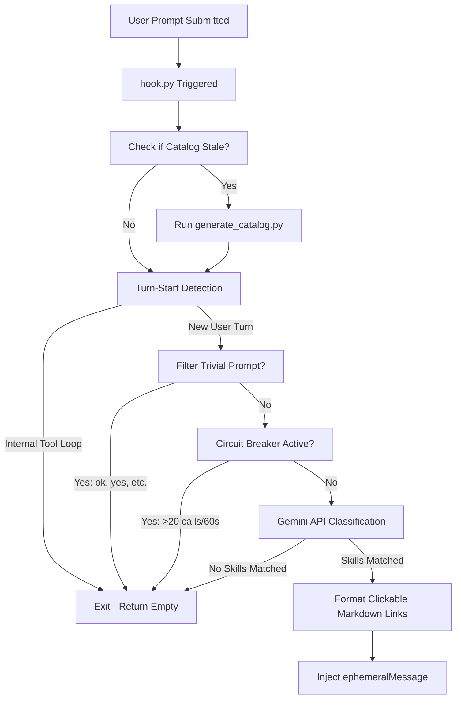

> **One-line Summary**: PreInvocation hook that classifies prompts against a skill catalog and injects matching SKILL.md links to fix lazy-agent skill skipping in Antigravity.

---
title: Skill Router Specification
tags:
  - documentation
  - architecture
  - skill-router
  - antigravity
aliases:
  - Skill Router Spec
  - Skill Router Docs
date: 2026-07-01
---

# Skill Router Hook

**Implementation:** `~/.gemini/config/skill-router/` · **Related:** [[03-Resources/Skills/Lazy-Agent-Failure-Mode|Lazy Agent Failure Mode]] · [[Clippings/Agent Skill Problem|clipping]]

The **Skill Router** is a lightweight, pre-invocation hook system for Google Antigravity. It intercepts incoming user prompts, evaluates them against a catalog of available agent skills, and dynamically injects direct markdown references to matching skills into the prompt context. This ensures that the agent utilizes relevant project-specific instructions without wasting context window space on irrelevant skills.

---

## 1. What is the Skill Router?

The Skill Router is a standalone pipeline configured to run as a `PreInvocation` hook within Antigravity. 

When a user submits a prompt:
1. The hook intercepts the turn before the main agent runs.
2. It classifies the user prompt against a catalog of available skills using a fast LLM call.
3. If any relevant skills are matched, it injects a targeted list of clickable markdown links (`file:///...`) and their descriptions into the prompt context via an `ephemeralMessage`.
4. The main agent starts its turn equipped with clear guidance on which skills to load and read.

---

## 2. Why was it Created?

### The "Lazy Agent" Problem
In complex projects, agents frequently fail to load relevant project-specific skills (located under `.agents/skills/`) when a user's prompt implicitly requires one. This "Lazy Agent" behavior occurs because the main agent is unaware of the full scope of available skills unless it spends valuable time and context searching directories.

### The Context Window / Cost Dilemma
Simply appending all available skills (59+ in this environment) to the system prompt of every session is highly inefficient. It dramatically increases latency, wastes API tokens, and dilutes the agent's focus. 

The Skill Router resolves this dilemma by dynamically routing only relevant skills to the agent's context on a turn-by-turn basis.

---

## 3. Architecture & File Layout

The components are placed in a dedicated directory outside the active workspace to prevent file pollution:

```
~/.gemini/config/skill-router/
├── catalog.json                  # Cached metadata of all skill names, descriptions, and file paths
├── generate_catalog.py           # Scans active skill roots and builds catalog.json
├── hook.py                       # PreInvocation entrypoint script executed on user turns
└── classifier_rate_limit.json    # Rate-limiter database tracking API call timestamps
```

### Hook Registration
The hook is registered in the global configuration file `~/.gemini/config/hooks.json` under the `PreInvocation` array:

```json
{
  "skillRouter": {
    "PreInvocation": [
      {
        "type": "command",
        "command": "python3 /home/redmane/.gemini/config/skill-router/hook.py",
        "timeout": 25
      }
    ]
  }
}
```

---

## 4. How it Works (Internal Logic)



### Key Subsystems

#### A. Stale Catalog Auto-Regeneration
To ensure new or updated skills are classified immediately, `hook.py` compares the modification time of `catalog.json` against the modification times of `generate_catalog.py` and all `SKILL.md` files under the skill roots. If any file is newer, the generator is invoked automatically.

#### B. Turn-Start Detection
To prevent calling the classifier during internal agent tool loops (which would spike API costs and loop indefinitely), the hook parses the JSONL transcript file backwards. It only proceeds if the most recent event is a `USER_INPUT` or `USER_EXPLICIT` type without any intervening `MODEL` or `PLANNER_RESPONSE` actions.

#### C. Circuit Breaker (Rate Limiter)
A local rate limiter database (`classifier_rate_limit.json`) tracks rolling timestamps. If the number of classification API calls exceeds 20 within a 60-second window, the circuit breaker trips, logs an error to `stderr`, and fails open gracefully.

#### D. Gemini API Classifier
- **Model**: `gemini-flash-latest` (configured via `MODEL_NAME` to use the direct REST API endpoint).
- **Format**: Requests a strict JSON array matching user input against the catalog.

---

## 5. Timeline & History

- **Monday (June 29, 2026)**: Research and initial architectural design of the hook system.
- **Tuesday (June 30, 2026)**: Initial implementation, REST API integrations, and hook configuration.
- **Wednesday (July 1, 2026 - Today)**: Audited the system, identified major gaps, and patched them in the evening:
  - Added logging for all silent exceptions to `sys.stderr`.
  - Switched the API endpoint to a valid model identifier (`gemini-flash-latest`).
  - Added automatic stale catalog regeneration.
  - Switched injection format to rich markdown with clickable file links.
  - Documented turn-start race conditions.

---

## 6. Patched Gaps & Technical Notes

### Gaps Resolved on July 1, 2026
1. **Silent Failures**: Previously, all error states failed silently, returning an empty injection. Now, every exception prints a detailed traceback to `sys.stderr` prefixed with `[skill-router] ERROR:` before falling open, allowing developers to debug classification, network, or filesystem errors.
2. **REST API Endpoint (404)**: Direct calls to `gemini-1.5-flash` returned a 404 error from the REST endpoint. We listed the available model catalog via the API key and transitioned the model variable to `gemini-flash-latest`.
3. **Lazy Ephemeral Guidance**: Initially, the classifier only injected a list of matching skill names. If the agent lacked context on where these files were, it ignored the hint. We modified the catalog to store absolute file paths, and the hook now injects a bulleted markdown checklist with clickable file links (e.g. `[skill-name](file:///path/to/SKILL.md)`).
4. **Out-of-Date Cache**: The catalog was static. We added automatic staleness checks comparing timestamps on startup.

### Known Limitations (Race Condition)
Because the pre-invocation hook is stateless and reads from the shared JSONL transcript, a race condition exists in highly concurrent environments where multiple background tasks or tool loops might write to the transcript simultaneously. In a standard single-user CLI/TUI environment, this concurrency is dormant and turn-start detection remains stable.

---

## 7. Frequently Asked Questions

### How do I configure the classifier's temperature or timeouts?
These parameters are defined directly at the top of `hook.py`:
- `MODEL_NAME = "gemini-flash-latest"`
- `TIMEOUT_SECONDS = 15`
- The REST API payload uses `generationConfig.temperature = 0.0` to enforce deterministic classification.

### What happens if the Gemini API goes down or is blocked?
The hook follows strict "fail-open" constraints. Any exception raised during the classification call is logged to `sys.stderr` and a standard empty payload (`{"injectSteps": []}`) is outputted. The user's turn proceeds normally without blocking the main agent.

### How are custom workspace skills combined with global skills?
`generate_catalog.py` scans two roots:
1. `~/.agents/skills` (Workspace skills)
2. `~/.gemini/antigravity-cli/builtin/skills` (Global built-in skills)
It deduplicates overlapping skill names by giving priority to workspace skills, allowing you to override built-in skills locally.

---

## 8. Future Directions & Open Questions

The following architectural questions and tentative feedback represent open design questions for future iterations of the Skill Router:

### Q1: Automatic Full-Content Inlined Skill Injection
* **Question**: Instead of just injecting clickable markdown links instructing the agent to read the `SKILL.md` files, should the hook automatically inline the entire contents of high-confidence matched `SKILL.md` files directly into the prompt context?
* **Tentative Feedback (Inadequate/Unverified)**: No. Inlining the full context will delay the system. Once the main agent sees that skill and description, it loads it immediately. Adding the full context will delay the whole system.

### Q2: Multi-Turn Context for Trivial Prompts
* **Question**: Currently, trivial prompts (e.g. "go ahead", "do it") are bypassed to save API calls. If a user says "do it" in response to a plan requiring a specific skill, the routing classification is skipped. Should the hook evaluate the previous turn's context when a trivial prompt is detected?
* **Tentative Feedback (Inadequate/Unverified)**: It is unlikely this would cause major issues, but analyzing the previous chat transcript to reconstruct intent would introduce latency and complexity. Unless there is a highly optimized tool that can scan for specific keywords triggering a turn, the outcomes and options are too broad. This warrants further review.

### Q3: Static Local Routing Rules
* **Question**: Should we support a static local rules file (e.g. mapping key patterns directly to skill paths without LLM calls) to bypass classifier latency?
* **Tentative Feedback (Inadequate/Unverified)**: Yes, this could work and would be a valuable fallback or optimization method.

### Q4: Hook Latency Budget
* **Question**: What is the acceptable maximum latency budget for the pre-invocation hook?
* **Tentative Feedback (Inadequate/Unverified)**: The hook has a budget of 5 to 10 seconds.

